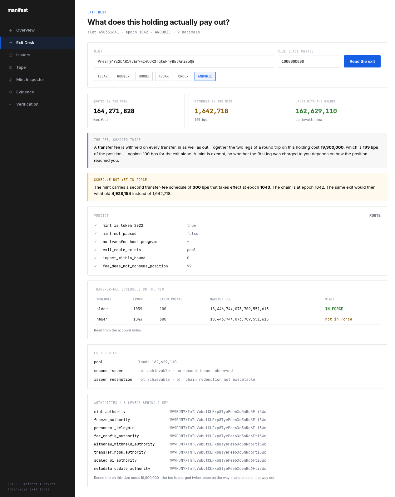
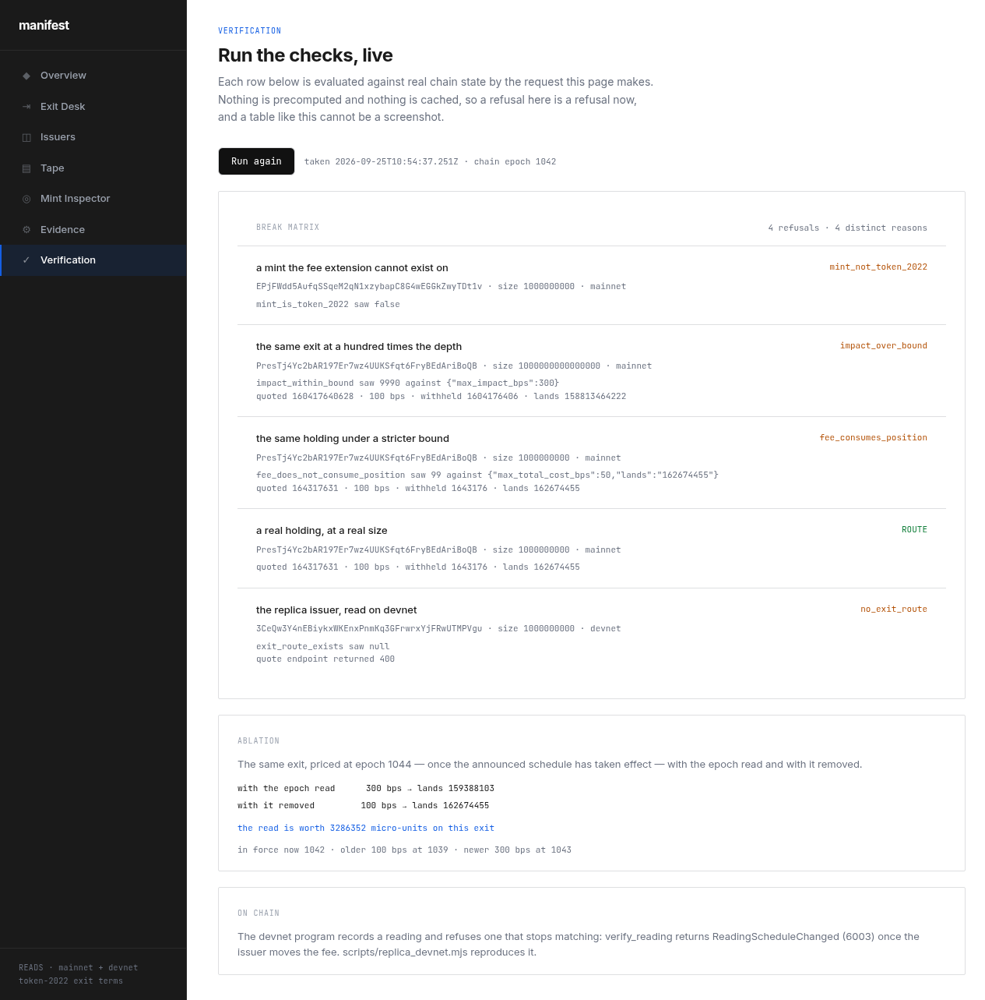

<div align="center">

# Manifest

**Exit terms for tokenized equities on Solana, read from the mint itself.**

[](https://manifest-mocha-six.vercel.app)
[](#proof)
[](https://explorer.solana.com/address/pTpaE75ubNyv9voydPJNaEfmv3GbmcN5bvZBfnRtdiA?cluster=devnet)
[](#proof)
[](LICENSE)
[](https://solana.com)

</div>

A tokenized equity can be trading at 100 basis points on the way out while the
mint already carries a 300 basis point schedule scheduled to take effect at a
named epoch. Both values are public, both are in the account bytes, and almost
nothing shows either of them.

Manifest reads the exit terms out of the mint and reports three numbers in
order: **what the pool quoted**, **what the mint withholds**, and **what lands**.
A quote is not a payout, and the difference is the product.

## See it in one command

```bash
curl -s 'https://manifest-mocha-six.vercel.app/api/exit?mint=PresTj4Yc2bAR197Er7wz4UUKSfqt6FryBEdAriBoQB&size=1000000000'
```

Real output, unedited, one request to mainnet:

```json
{
  "mint": "PresTj4Y…", "size": "1000000000", "slot": 450311310, "epoch": "1042",
  "quote": { "venue": "pool", "out_amount": "162733915", "price_impact_bps": 0 },
  "verdict": {
    "verdict": "ROUTE",
    "landing": {
      "quoted_out":   "162733915",
      "schedule_bps": 100,
      "withheld":     "1627339",
      "lands":        "161106576",
      "pending_bps":  300,
      "pending_epoch": "1043",
      "withheld_after_pending": "4882017"
    }
  }
}
```

At slot 450311310 the pool quoted 162,733,915. The mint withheld 1,627,339.
What landed was 161,106,576. Once the announced schedule takes effect at epoch
1043, the same exit withholds 4,882,017 — three times as much.

Both numbers move with the pool, so run the command for the current ones. The
schedule numbers do not: they change only when the issuer signs a new one.

## The one fact that matters

```
$ node --test app/lib/exit-terms.test.mjs
  LIVE PresTj4Y…  slot=450306499 epoch=1042
  older=100bps@1039  newer=300bps@1043
  IN FORCE NOW: 100bps   PENDING: 300bps at epoch 1043
  authorities: 8 levers, 1 distinct key(s)
```

Token-2022's `TransferFeeConfig` carries **two** schedules. The one in force at
epoch *E* is the newer schedule when *E* is at or past `newer.epoch`, and the
older one otherwise. That single rule is why an announced increase is readable
today, before it is charged.

## On screen



One holding at a named slot. Quoted by the pool, withheld by the mint, lands with
the holder, in that order, with the schedule the issuer has already signed and not
yet charged called out beneath them, and the round trip below that. The slot is in
the frame.



Four refusals with four distinct reasons, each printing the live value that
tripped it, evaluated by the request the page made rather than read from a table.
The ablation underneath the matrix is the same run.

Both frames are live reads taken at the slots they display, so the figures in them
are not the figures quoted elsewhere in this file. That is what a live number
looks like: it moves, and the slot is the only thing that pins it.

## Surfaces

| Surface | What it answers | Link |
|---|---|---|
| Exit Desk | Three numbers, six checks, every route | [/exit](https://manifest-mocha-six.vercel.app/exit) |
| Issuer Board | Every registry mint, read live, grouped by issuer | [/issuers](https://manifest-mocha-six.vercel.app/issuers) |
| Mint Inspector | Both fee schedules and the key behind each authority | [/mint/XsDoVfqe…](https://manifest-mocha-six.vercel.app/mint/XsDoVfqeBukxuZHWhdvWHBhgEHjGNst4MLodqsJHzoB) |
| Tape | Append-only ledger of readings, with the slot each was taken at | [/tape](https://manifest-mocha-six.vercel.app/tape) |
| Evidence | Every claim mapped to the command that reproduces it | [/evidence](https://manifest-mocha-six.vercel.app/evidence) |
| Verification | Four refusals and the ablation, evaluated on the click | [/verify](https://manifest-mocha-six.vercel.app/verify) |
| Health | Each dependency checked separately, failing loudly | [/api/health](https://manifest-mocha-six.vercel.app/api/health) |

## Why bytes, not parsed JSON

`getAccountInfo` with `jsonParsed` returns u64 fields as JSON numbers. A u64
maximum fee can be `2^64-1`, which a double cannot hold. The parsed read returns
`18446744073709551616` — one more than the chain stores.

The fee fields are therefore lifted from the account bytes. The
`TransferFeeConfig` extension is 108 bytes at TLV offset 166:

```
[  0: 32] transfer_fee_config_authority
[ 32: 64] withdraw_withheld_authority
[ 64: 72] withheld_amount        u64
[ 72: 90] older  epoch u64, maximum_fee u64, basis points u16
[ 90:108] newer  epoch u64, maximum_fee u64, basis points u16
```

## Exit checks

Run in this order. The first failure becomes the verdict; the rest are still
recorded, because knowing which other conditions also fail is useful.

| # | Check | Refusal code |
|---|---|---|
| 1 | `mint_is_token_2022` | `mint_not_token_2022` |
| 2 | `mint_not_paused` | `mint_paused` |
| 3 | `no_transfer_hook_program` | `transfer_hook_installed` |
| 4 | `exit_route_exists` | `no_exit_route` |
| 5 | `impact_within_bound` | `impact_over_bound` |
| 6 | `fee_does_not_consume_position` | `fee_consumes_position` |

A refusal is a different statement from a zero, and it carries a name.

## Proof

```bash
git clone https://github.com/subheeksh5599/manifest.git
cd manifest/app && npm install && npm test
```

```
ℹ tests 404
ℹ pass  404
ℹ fail  0
```

```
$ cd manifest && cargo test --manifest-path programs/exit_terms/Cargo.toml --lib
test result: ok. 10 passed; 0 failed; 0 ignored; 0 measured; 0 filtered out
```

The Rust tests parse a real mint's TLV region — the fee config sits behind two
other extensions in that account, so the fixture exercises the walk rather than
a lookup at a fixed offset.

Reading six mints at once tripped the public endpoint's rate limit, which showed
as a comparison board with holes in it. Reads now take a second endpoint when the
first refuses, run with a ceiling on how many are in flight, and repeat a recent
result for 90 seconds instead of re-reading the chain. Every surface still prints
the slot the reading came from, so a cached number is never presented as a fresh
one.

```
$ python3 scripts/verify_receipts.py
  PASS  ANDURIL: maximum fee is exactly 2^64-1                  18446744073709551615
  PASS  ANDURIL: the same value through a float is wrong        18446744073709551616
  PASS  ANDURIL: the two schedules are ordered                  1039 -> 1043
  PASS  ANDURIL: schedule in force at epoch 1042                100 bps @ epoch 1039
  PASS  docs address PresTj4Yc2…                                mainnet · README.md
  PASS  docs signature bBz4KBZ1Hv…                              devnet · README.md

  mints read            6
  charged at the exit   1
  a change scheduled    1
  checks                25/25 passed
```

`scripts/verify_receipts.py` is a deliberately **independent** implementation.
It walks the Token-2022 TLV region in Python and re-derives both schedules from
raw account bytes. It does not import the TypeScript module, so a bug there
cannot hide behind itself. If the two disagree, the site is wrong.

It also resolves every address and every signature these documents quote, against
mainnet and then devnet. A definite negative fails the run; an RPC that will not
answer does not, because a network failure is not evidence about a document.

That check is load-bearing, and it was tested by breaking it. Changing one
character of the Anduril mint address in this file turns 25/25 into 24/25 and the
run exits non-zero:

```
  FAIL  docs address PresTj4Yc2…                                not on devnet · README.md
  checks                24/25 passed
  1 check(s) FAILED: a published number did not reproduce
```

```
$ python3 scripts/adversarial_gate.py
  PASS  ablation_understates_the_exit  —  300bps vs 100bps -> overstates the exit by 40,000,000,000 micro-units
  PASS  read_follows_the_bytes         —  100 -> 65535 bps from the bytes alone
  PASS  zero_cap_charges_nothing       —  a zero maximum fee charges nothing, and the bytes say so
  PASS  absent_fee_is_not_a_schedule   —  reads as absent, so nothing is scheduled rather than zero
  PASS  missing_mint_is_not_zero       —  sGCjibff… holds nothing, so no reading is invented

  5/5 hostile checks passed
```

The first check is the ablation: ignore the not-yet-in-force schedule and the
same position is priced wrong by 40,000,000,000 micro-units. That is what makes
the epoch read load-bearing rather than decorative.

## Before anything else

No key is committed to this repository, and the hook is what makes that true
rather than intended:

```bash
git config core.hooksPath .githooks
```

`scripts/check_no_secrets.py` looks for the three things that actually turn up:
a Solana keypair (a JSON array of 64 small integers, which is an unremarkable
looking `.json` file), a private key file, and a `.env` or an assignment naming
a secret. It refuses the commit. A credential that was ever pushed has to be
rotated, because removing the file does not remove it from history. The same
check runs in CI over every tracked file, so it cannot be skipped locally.

## The record, on devnet

A number on a website is a claim. The same number written by a program is a
record with a slot that anyone can re-check. The program takes the mint account
and writes down what it read.

| Instruction | What it does |
|---|---|
| `record_reading` | Walks the mint's TLV region, selects the schedule in force by epoch, and writes size, withheld and lands to a PDA |
| `verify_reading` | Recomputes the same numbers from the mint and **refuses** if they no longer match the record |

Program `pTpaE75ubNyv9voydPJNaEfmv3GbmcN5bvZBfnRtdiA`, devnet.

Reproduce the whole thing from nothing:

```bash
cd scripts && npm install && cd ..
node scripts/prove_onchain.mjs
```

That creates a mint, gives it a fee announced for a future epoch, records a
reading, verifies it, moves the fee and shows verification refuse. Real output
from that script, on devnet:

```
mint created      D5oVtn8g9anzdKPXYTPDtt9f67WWwRLoVPp5eWbp4MmT
fee announced     older 100 bps @ epoch 1166   newer 300 bps @ epoch 1168
                  => in force 100 bps, pending 300 bps @ epoch 1168

record_reading    ok   bBz4KBZ1HvKLoSfZzoaNx5U8SkuBxTw9GbruvmGxL6ZLCKSjt3FDL99AMggViZ7GdyeHxKNhsnH33UzbGYZyMV7
  bps in force    100  (chain says 100)
  bps pending     300  (chain says 300)
  maximum fee     18446744073709551615  exact 2^64-1: true
  withheld        10000000  computed: 10000000
  lands           990000000 = size - withheld: 990000000
  matches the mint: true

verify_reading    PASS 3r7DQej4Xh9hZUSnmJJqT8PsEWKWEno2NZzGLL7X4mo4cjdgXmRpm7bBDrmguhJyNk8CpsYb8744oUNbgr8ZXqX

fee moved to      500 bps @ epoch 1168
verify_reading    REFUSED
  Error Code: ReadingScheduleChanged. Error Number: 6003.
  Error Message: the pending schedule is not the one the reading recorded.
```

Note what the chain wrote when the fee was announced: `newer 300 bps @ epoch 1168`
while the chain was at epoch 1166. A fee really is written ahead of the epoch it
takes effect in, which is the premise this product is built on.

The last line is the one that matters. A published number that stops being true
is refused by the chain, not by a database.

## The scenario, recreated on devnet

The fee schedules on mainnet belong to someone else, and showing what happens
after a schedule lands would mean waiting for an issuer to sign one. Devnet
removes the wait.

Two issuers of one company, created as real Token-2022 mints with real
transfer-fee extensions:

| | mint | terms |
|---|---|---|
| issuer A | `DjvERvY5tuuZzWziNSqMCdUxNeg7adfVCHVR9eQnSjGb` | 0 bps, nothing withheld |
| issuer B | `3CeQw3Y4nEBiykxWKEnxPnmKq3GFrwrxYjFRwUTMPVgu` | 100 bps in force, **300 bps announced for epoch 1168** |

Then the exit is measured rather than computed. Tokens move, the mint's own
extension takes its cut, and the difference between what left and what arrived is
read back off the account bytes and compared against the arithmetic this product
publishes:

```
node scripts/replica_devnet.mjs exit

issuer A
  sent          100000000
  withheld      0   the product computed 0
  landed        100000000   the product computed 100000000
  agrees        true

issuer B
  sent          100000000
  withheld      1000000   the product computed 1000000
  landed        99000000   the product computed 99000000
  agrees        true
  announced, not yet charged: 300 bps at epoch 1168
  the same exit then: withheld 3000000, landed 97000000
```

The last two lines are the product's whole argument, executed: nothing is
withheld today on issuer A, a percent is withheld on issuer B, and when the
schedule the issuer already signed takes effect the same exit costs three times
as much.

Two things this measured that a calculation would have hidden. A token account's
extensions begin at byte 166, not 165, because of the account-type byte, so a
walk started at 165 reads a withheld fee as no fee at all. And the withheld
amount is extension type 2, where type 9 is NonTransferable.

## Honesty table

| Claim | Status | How to check |
|---|---|---|
| Exit terms read from mainnet mints | Done | `curl https://manifest-mocha-six.vercel.app/api/issuers` |
| Fee schedule selected by epoch | Done | `node --test app/lib/exit-terms.test.mjs` |
| u64 fee fields read from account bytes | Done | `python3 scripts/verify_receipts.py --check` |
| Quote priced down to what lands | Done | `curl '…/api/exit?mint=…&size=…'` |
| Two issuers read and compared live | Done | `curl https://manifest-mocha-six.vercel.app/api/issuers` |
| Readings recorded with their slot | Done | `tail -3 app/data/readings.jsonl` |
| Independent Python verifier agrees | Done | `python3 scripts/verify_receipts.py` |
| **Executing a swap on mainnet** | **Not claimed** | The site reads and prices. It does not sign. |
| **An issuer redemption window** | **Not claimed** | That path is off chain, so it is never shown as achievable. |
| **A second issuer for the same company** | **Not claimed** | Reported as not observed until one is read on chain. |
| On-chain reading record (devnet) | Done | `solana program show pTpaE75ubNyv9voydPJNaEfmv3GbmcN5bvZBfnRtdiA --url devnet` |
| The fee is measured on devnet, not computed | Done | `node scripts/replica_devnet.mjs exit` |
| Two issuers with different terms, tradeable | Done | `node scripts/replica_devnet.mjs show` |
| A reading that stops reproducing is refused | Done | The `verify_reading` refusal above, error 6003 |
| **Executing the exit itself on-chain** | **Not claimed** | The program records and verifies a reading. It does not move tokens. |
| **Underwriting, insurance, or payout** | **Not claimed** | This is a read-and-price layer. |

## Architecture

```
app/lib/exit-terms.mjs        read the mint; epoch-selected fee; exact TLV read
app/lib/exit-engine.mjs       quote -> landing; six checks; route comparison
app/lib/*.test.mjs            404 tests, including a live read and the matrices
app/lib/*.matrix.test.mjs     the fee arithmetic, the epoch rule and the routes
                              across their domains, not at sample points
app/app/exit/                 the desk
app/app/issuers/              the cross-issuer board
app/app/tape/                 the reading ledger
app/app/evidence/             claim -> artifact -> command
app/app/mint/[addr]/          one mint, in full
app/data/registry.json        identity only, so nothing measured can go stale
app/data/readings.jsonl       appended by the verifier, never hand-written

programs/exit_terms/          the Anchor program (devnet)
  src/lib.rs                  read_fee_config, record_reading, verify_reading
  src/state/reading.rs        the 166-byte record
  src/fixture.rs              a real mint's TLV region, embedded unchanged

scripts/verify_receipts.py    independent Python re-derivation of the fee fields
scripts/adversarial_gate.py   five hostile checks, including the ablation
scripts/prove_onchain.mjs     builds the devnet scenario and shows the refusal
scripts/replica_devnet.mjs    two real devnet issuers, and the fee measured
scripts/check_no_secrets.py   refuses credentials on the way in, not after
```

## Stack

| Layer | Tool |
|---|---|
| Read | Solana mainnet RPC, `getAccountInfo` base64 + jsonParsed |
| Pricing | A public quote aggregator, at the requested size |
| App | Next.js 16, React 19, TypeScript strict |
| Tests | `node --test` (404) plus a Python verifier (25 checks) |
| Assets | Token-2022 mints from two issuers |

## License

MIT — 2026
