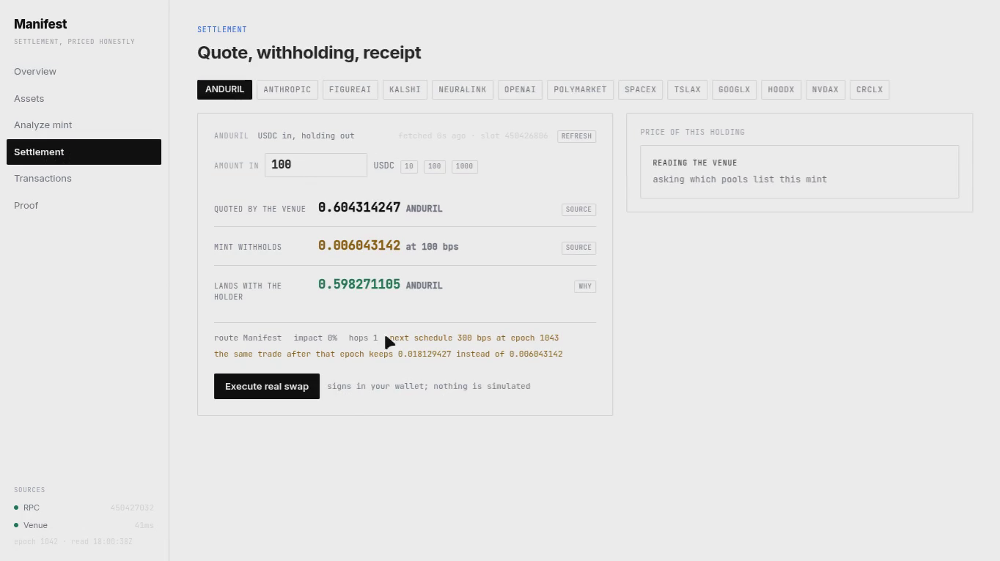
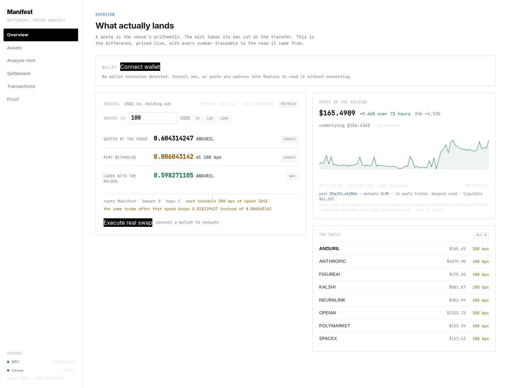
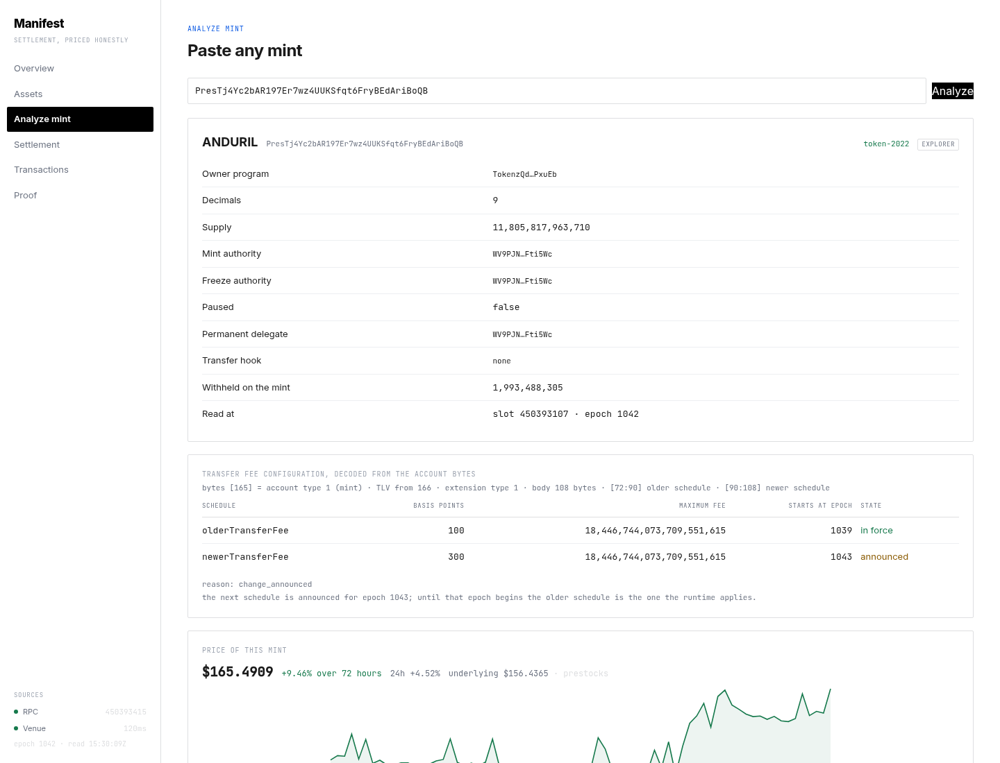
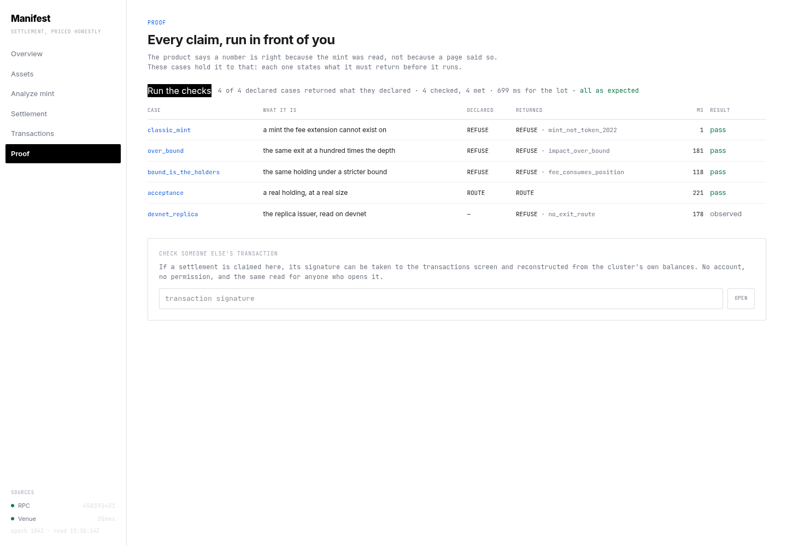
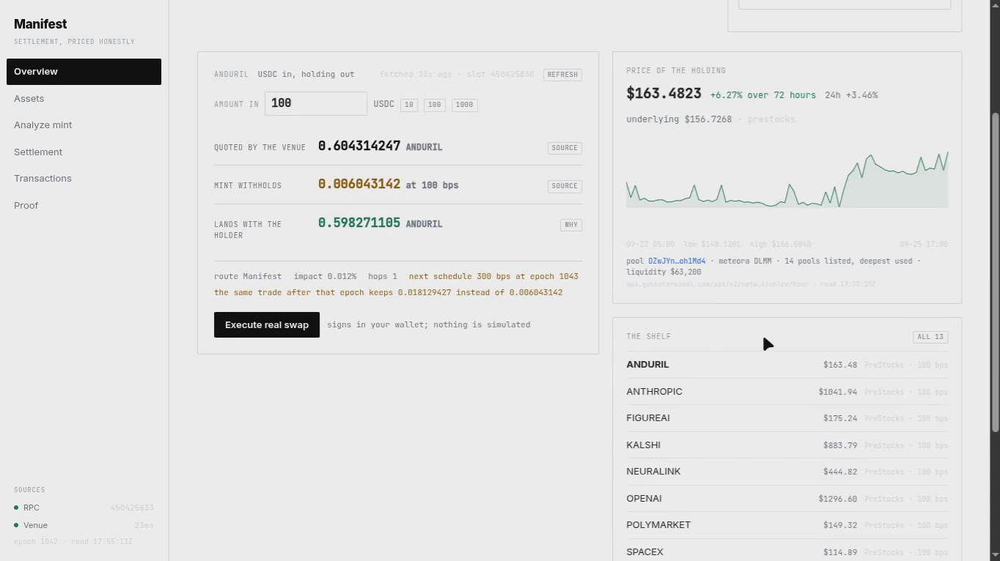
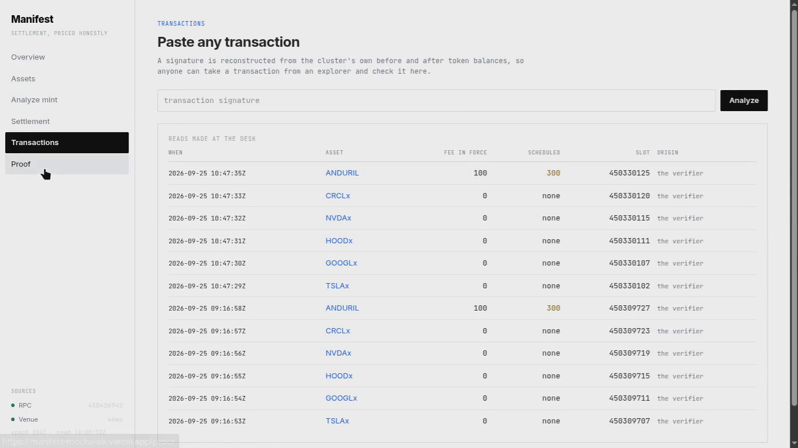
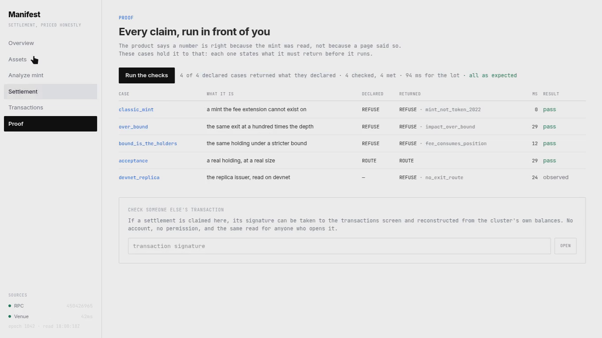
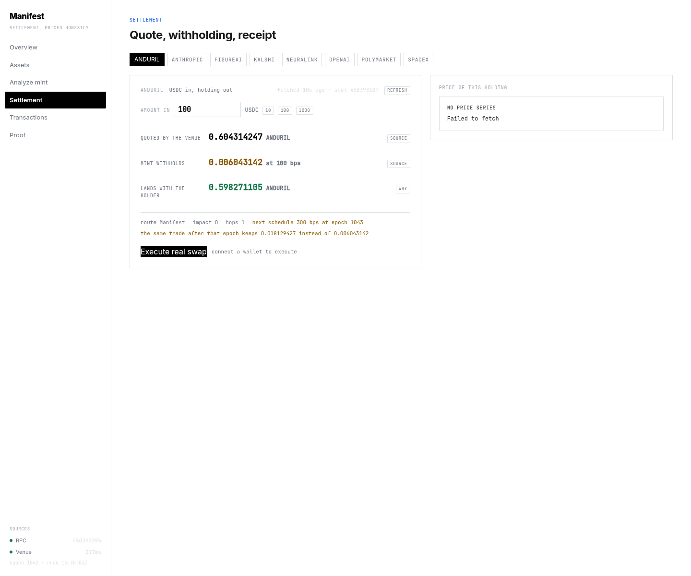

<div align="center">

# Manifest

**Exit terms for tokenized equities on Solana, read from the mint itself.**

[](https://manifest-mocha-six.vercel.app)
[](https://youtu.be/SIS0Fvh6_Kg)
[](#proof)
[](https://explorer.solana.com/address/pTpaE75ubNyv9voydPJNaEfmv3GbmcN5bvZBfnRtdiA?cluster=devnet)
[](#proof)
[](LICENSE)
[](https://solana.com)

</div>

A tokenized equity can be trading at 100 basis points on the way out while the
mint already carries a 300 basis point schedule scheduled to take effect at a
named epoch. Both values are public, both are in the account bytes, and almost
nothing shows either of them.

Manifest reads the exit terms out of the mint and reports three numbers in
order: **what the pool quoted**, **what the mint withholds**, and **what lands**.
A quote is not a payout, and the difference is the product.

## ▶ Watch the walkthrough

[](https://youtu.be/SIS0Fvh6_Kg)

Two minutes of the site on devnet, no terminal in frame: the desk reading the mint, the assets
board where one fee is in force and another is scheduled, the raw account read behind both, one
exit priced with its quote and its withholding, the signature, and a receipt rebuilt from the
cluster's own balances.

The recording is one take. Two stretches were cut rather than performed again: the wallet's risk
gate on the swap, and an explorer pointed at Mainnet Beta returning `Not Found` for a devnet
signature. Every kept segment, every removed one, and the reason for each is in
[`demo/NARRATION.md`](demo/NARRATION.md); the click script is in [`demo/CLICKS.md`](demo/CLICKS.md).

> **▶ [Watch the walkthrough on YouTube](https://youtu.be/SIS0Fvh6_Kg)** — 2:04, the same cut as
> the file below it. The copy at [`demo/media/manifest-demo.mp4`](demo/media/manifest-demo.mp4)
> is there so the file survives the link.

**Contents** · [PreStocks integration](#prestocks-integration) · [See it in one command](#see-it-in-one-command) · [The one fact that matters](#the-one-fact-that-matters) · [Screenshots](#screenshots) · [Surfaces](#surfaces) · [Exit checks](#exit-checks) · [Proof](#proof) · [The record, on devnet](#the-record-on-devnet) · [What this is not](#honesty-table) · [Stack](#stack) · [License](#license)

## PreStocks integration

Discovery is the PreStocks API, `https://prestocks.com/api/prestocks`, not a hardcoded list.
The shelf is whatever that endpoint publishes; today it is eight pre-IPO mints. Their exit terms
are then read from the mints themselves, because the API carries no fee fields and a page that
says "100 bps" is not a source.

| Mint | In force | Scheduled | At epoch | SPV mark (from the API) | Token price (from the chain) |
|---|---|---|---|---|---|
| ANDURIL | 100 bps | 300 bps | 1043 | 156.88 | 164.48 |
| ANTHROPIC | 100 bps | 300 bps | 1043 | 1058.74 | 1053.27 |
| FIGUREAI | 100 bps | 300 bps | 1043 | 180.28 | 180.07 |
| KALSHI | 100 bps | 300 bps | 1043 | 885.46 | 886.60 |
| NEURALINK | 100 bps | 300 bps | 1043 | 337.13 | 449.39 |
| OPENAI | 100 bps | 300 bps | 1043 | 1023.83 | 1296.25 |
| POLYMARKET | 100 bps | 300 bps | 1043 | 145.74 | 153.60 |
| SPACEX | 100 bps | none | — | 148.13 | 118.38 |

Read at slot 450439688, unedited. Seven of the eight carry an increase the API does not publish:
100 bps in force, 300 bps from epoch 1043. Every row also carries the mint's `maximum_fee`,
which on these eight is `18446744073709551615` — the ceiling the issuer may raise the fee to
without asking anyone, and the number that makes the scheduled one worth knowing in advance.

The two columns are read from different places on purpose. The API supplies identity, the SPV
mark, the supply and the issuer's description; the chain supplies the fee schedule, the
authorities, the pause flag and the transfer hook. Both sit on the row at once, so the gap
between the issuer's mark and the on-chain price is visible rather than implied: NEURALINK at
337.13 against 449.39, SPACEX at 148.13 against 118.38.

## See it in one command

```bash
curl -s 'https://manifest-mocha-six.vercel.app/api/exit?mint=PresTj4Yc2bAR197Er7wz4UUKSfqt6FryBEdAriBoQB&size=1000000000'
```

Real output, unedited, one request to mainnet:

```json
{
  "mint": "PresTj4Y…", "size": "1000000000", "slot": 450311310, "epoch": "1042",
  "quote": { "venue": "pool", "out_amount": "162733915", "price_impact_bps": 0 },
  "verdict": {
    "verdict": "ROUTE",
    "landing": {
      "quoted_out":   "162733915",
      "schedule_bps": 100,
      "withheld":     "1627339",
      "lands":        "161106576",
      "pending_bps":  300,
      "pending_epoch": "1043",
      "withheld_after_pending": "4882017"
    }
  }
}
```

At slot 450311310 the pool quoted 162,733,915. The mint withheld 1,627,339.
What landed was 161,106,576. Once the announced schedule takes effect at epoch
1043, the same exit withholds 4,882,017 — three times as much.

Both numbers move with the pool, so run the command for the current ones. The
schedule numbers do not: they change only when the issuer signs a new one.

## The one fact that matters

```
$ node --test app/lib/exit-terms.test.mjs
  LIVE PresTj4Y…  slot=450306499 epoch=1042
  older=100bps@1039  newer=300bps@1043
  IN FORCE NOW: 100bps   PENDING: 300bps at epoch 1043
  authorities: 8 levers, 1 distinct key(s)
```

Token-2022's `TransferFeeConfig` carries **two** schedules. The one in force at
epoch *E* is the newer schedule when *E* is at or past `newer.epoch`, and the
older one otherwise. That single rule is why an announced increase is readable
today, before it is charged.

## Screenshots

### From the live site



One holding at a named slot. Quoted by the pool, withheld by the mint, lands with
the holder, in that order, with the schedule the issuer has already signed and not
yet charged called out beneath them, and the round trip below that. The slot is in
the frame.



The second route, on devnet. Two issuers, each with a real pool quoted against
wrapped SOL, both vault balances read on the page load, and the exit across them
in a single transaction: two swaps, 100,000,000 of issuer B sold and 94,306,362
of issuer A landed, with that transaction linked beneath it.



Four refusals with four distinct reasons, each printing the live value that
tripped it, evaluated by the request the page made rather than read from a table.
The ablation underneath the matrix is the same run.

All three frames are live reads taken at the slots they display, so the figures in them
are not the figures quoted elsewhere in this file. That is what a live number
looks like: it moves, and the slot is the only thing that pins it.

### From the walkthrough

Three frames taken out of the recording, at the slots they show.



The board on the left is where the two schedules sit side by side. One column is what
leaving costs at this epoch; the other is what it will cost once the signed schedule
starts charging.



The receipt is not a log the app keeps. It is rebuilt on the request from the
cluster's own before and after balances, so a signature taken off any explorer can be
checked here against the chain rather than against this page.



Each case states what it must return before it runs, and the page reports the ones that
did not.

## Surfaces

| Surface | What it answers | Link |
|---|---|---|
| Dashboard | Sidebar shell: your wallet, live sources, the shelf, a price series | [/app](https://manifest-mocha-six.vercel.app/app) |
| Settlement | Quote, withholding, receipt — every number with the source it came from | [/settle](https://manifest-mocha-six.vercel.app/settle) |
| Assets | Every mint this can price, and what leaving each one costs | [/assets](https://manifest-mocha-six.vercel.app/assets) |
| Analyze mint | Paste any mint: both fee schedules decoded from the account bytes | [/analyze](https://manifest-mocha-six.vercel.app/analyze?mint=PresTj4Yc2bAR197Er7wz4UUKSfqt6FryBEdAriBoQB) |
| Transactions | Reconstruct any signature from the cluster's own balances | [/tx](https://manifest-mocha-six.vercel.app/tx) |
| Proof | Every claim, run in front of you, on the click | [/proof](https://manifest-mocha-six.vercel.app/proof) |
| Compare | One company at both issuers, priced at your size, with the rail between them | [/api/compare?size=100000000](https://manifest-mocha-six.vercel.app/api/compare?size=100000000) |
| Health | Each dependency checked separately, failing loudly | [/api/health](https://manifest-mocha-six.vercel.app/api/health) |

## Why bytes, not parsed JSON

`getAccountInfo` with `jsonParsed` returns u64 fields as JSON numbers. A u64
maximum fee can be `2^64-1`, which a double cannot hold. The parsed read returns
`18446744073709551616` — one more than the chain stores.

The fee fields are therefore lifted from the account bytes. The
`TransferFeeConfig` extension is 108 bytes at TLV offset 166:

```
[  0: 32] transfer_fee_config_authority
[ 32: 64] withdraw_withheld_authority
[ 64: 72] withheld_amount        u64
[ 72: 90] older  epoch u64, maximum_fee u64, basis points u16
[ 90:108] newer  epoch u64, maximum_fee u64, basis points u16
```

## Exit checks

Run in this order. The first failure becomes the verdict; the rest are still
recorded, because knowing which other conditions also fail is useful.

| # | Check | Refusal code |
|---|---|---|
| 1 | `mint_is_token_2022` | `mint_not_token_2022` |
| 2 | `mint_not_paused` | `mint_paused` |
| 3 | `no_transfer_hook_program` | `transfer_hook_installed` |
| 4 | `exit_route_exists` | `no_exit_route` |
| 5 | `impact_within_bound` | `impact_over_bound` |
| 6 | `fee_does_not_consume_position` | `fee_consumes_position` |

A refusal is a different statement from a zero, and it carries a name.

## Proof

```bash
git clone https://github.com/subheeksh5599/manifest.git
cd manifest/app && npm install && npm test
```

```
ℹ tests 423
ℹ pass  423
ℹ fail  0
```

```
$ cd manifest && cargo test --manifest-path programs/exit_terms/Cargo.toml --lib
test result: ok. 10 passed; 0 failed; 0 ignored; 0 measured; 0 filtered out
```

The Rust tests parse a real mint's TLV region — the fee config sits behind two
other extensions in that account, so the fixture exercises the walk rather than
a lookup at a fixed offset.

Reading six mints at once tripped the public endpoint's rate limit, which showed
as a comparison board with holes in it. Reads now take a second endpoint when the
first refuses, run with a ceiling on how many are in flight, and repeat a recent
result for 90 seconds instead of re-reading the chain. Every surface still prints
the slot the reading came from, so a cached number is never presented as a fresh
one.

```
$ python3 scripts/verify_receipts.py
  PASS  ANDURIL: maximum fee is exactly 2^64-1                  18446744073709551615
  PASS  ANDURIL: the same value through a float is wrong        18446744073709551616
  PASS  ANDURIL: the two schedules are ordered                  1039 -> 1043
  PASS  ANDURIL: schedule in force at epoch 1042                100 bps @ epoch 1039
  PASS  docs address PresTj4Yc2…                                mainnet · README.md
  PASS  docs signature bBz4KBZ1Hv…                              devnet · README.md

  mints read            6
  charged at the exit   1
  a change scheduled    1
  checks                30/30 passed
  appended 6 readings to app/data/readings.jsonl
```

The run records what it read, which is why the tree comes back with
`app/data/readings.jsonl` modified: the ledger is written by the verifier, never
by hand. `python3 scripts/verify_receipts.py --check` runs the same checks and
writes nothing, for a reader who wants the tree left alone.

`scripts/verify_receipts.py` is a deliberately **independent** implementation.
It walks the Token-2022 TLV region in Python and re-derives both schedules from
raw account bytes. It does not import the TypeScript module, so a bug there
cannot hide behind itself. If the two disagree, the site is wrong.

It also resolves every address and every signature these documents quote, against
mainnet and then devnet. A definite negative fails the run; an RPC that will not
answer does not, because a network failure is not evidence about a document.

That check is load-bearing, and it was tested by breaking it. Changing one
character of the Anduril mint address in this file turns 30/30 into 30/31 — the
mutation is a different token, so it is counted separately and fails on its own —
and the run exits non-zero:

```
  FAIL  docs address PresTj4Yc2…                                not on devnet · README.md
  checks                30/31 passed
  1 check(s) FAILED: a published number did not reproduce
```

```
$ python3 scripts/adversarial_gate.py
  PASS  ablation_understates_the_exit  —  300bps vs 100bps -> overstates the exit by 40,000,000,000 micro-units
  PASS  read_follows_the_bytes         —  100 -> 65535 bps from the bytes alone
  PASS  zero_cap_charges_nothing       —  a zero maximum fee charges nothing, and the bytes say so
  PASS  absent_fee_is_not_a_schedule   —  reads as absent, so nothing is scheduled rather than zero
  PASS  missing_mint_is_not_zero       —  sGCjibff… holds nothing, so no reading is invented

  5/5 hostile checks passed
```

The first check is the ablation: ignore the not-yet-in-force schedule and the
same position is priced wrong by 40,000,000,000 micro-units. That is what makes
the epoch read load-bearing rather than decorative.

## Before anything else

No key is committed to this repository, and the hook is what makes that true
rather than intended:

```bash
git config core.hooksPath .githooks
```

`scripts/check_no_secrets.py` looks for the three things that actually turn up:
a Solana keypair (a JSON array of 64 small integers, which is an unremarkable
looking `.json` file), a private key file, and a `.env` or an assignment naming
a secret. It refuses the commit. A credential that was ever pushed has to be
rotated, because removing the file does not remove it from history. The same
check runs in CI over every tracked file, so it cannot be skipped locally.

## The record, on devnet

A number on a website is a claim. The same number written by a program is a
record with a slot that anyone can re-check. The program takes the mint account
and writes down what it read.

| Instruction | What it does |
|---|---|
| `record_reading` | Walks the mint's TLV region, selects the schedule in force by epoch, and writes size, withheld and lands to a PDA |
| `verify_reading` | Recomputes the same numbers from the mint and **refuses** if they no longer match the record |

Program `pTpaE75ubNyv9voydPJNaEfmv3GbmcN5bvZBfnRtdiA`, devnet.

Reproduce the whole thing from nothing:

```bash
cd scripts && npm install && cd ..
node scripts/prove_onchain.mjs
```

That creates a mint, gives it a fee announced for a future epoch, records a
reading, verifies it, moves the fee and shows verification refuse. Real output
from that script, on devnet:

```
mint created      D5oVtn8g9anzdKPXYTPDtt9f67WWwRLoVPp5eWbp4MmT
fee announced     older 100 bps @ epoch 1166   newer 300 bps @ epoch 1168
                  => in force 100 bps, pending 300 bps @ epoch 1168

record_reading    ok   bBz4KBZ1HvKLoSfZzoaNx5U8SkuBxTw9GbruvmGxL6ZLCKSjt3FDL99AMggViZ7GdyeHxKNhsnH33UzbGYZyMV7
  bps in force    100  (chain says 100)
  bps pending     300  (chain says 300)
  maximum fee     18446744073709551615  exact 2^64-1: true
  withheld        10000000  computed: 10000000
  lands           990000000 = size - withheld: 990000000
  matches the mint: true

verify_reading    PASS 3r7DQej4Xh9hZUSnmJJqT8PsEWKWEno2NZzGLL7X4mo4cjdgXmRpm7bBDrmguhJyNk8CpsYb8744oUNbgr8ZXqX

fee moved to      500 bps @ epoch 1168
verify_reading    REFUSED
  Error Code: ReadingScheduleChanged. Error Number: 6003.
  Error Message: the pending schedule is not the one the reading recorded.
```

Note what the chain wrote when the fee was announced: `newer 300 bps @ epoch 1168`
while the chain was at epoch 1166. A fee really is written ahead of the epoch it
takes effect in, which is the premise this product is built on.

The last line is the one that matters. A published number that stops being true
is refused by the chain, not by a database.

## The scenario, recreated on devnet

The fee schedules on mainnet belong to someone else, and showing what happens
after a schedule lands would mean waiting for an issuer to sign one. Devnet
removes the wait.

Two issuers of one company, created as real Token-2022 mints with real
transfer-fee extensions:

| | mint | terms |
|---|---|---|
| issuer A | `DjvERvY5tuuZzWziNSqMCdUxNeg7adfVCHVR9eQnSjGb` | 0 bps, nothing withheld |
| issuer B | `3CeQw3Y4nEBiykxWKEnxPnmKq3GFrwrxYjFRwUTMPVgu` | 100 bps in force, **300 bps announced for epoch 1168** |

Then the exit is measured rather than computed. Tokens move, the mint's own
extension takes its cut, and the difference between what left and what arrived is
read back off the account bytes and compared against the arithmetic this product
publishes:

```
node scripts/replica_devnet.mjs exit

issuer A
  sent          100000000
  withheld      0   the product computed 0
  landed        100000000   the product computed 100000000
  agrees        true

issuer B
  sent          100000000
  withheld      1000000   the product computed 1000000
  landed        99000000   the product computed 99000000
  agrees        true
  announced, not yet charged: 300 bps at epoch 1168
  the same exit then: withheld 3000000, landed 97000000
```

The last two lines are the product's whole argument, executed: nothing is
withheld today on issuer A, a percent is withheld on issuer B, and when the
schedule the issuer already signed takes effect the same exit costs three times
as much.

Two things this measured that a calculation would have hidden. A token account's
extensions begin at byte 166, not 165, because of the account-type byte, so a
walk started at 165 reads a withheld fee as no fee at all. And the withheld
amount is extension type 2, where type 9 is NonTransferable.

### The route across issuers, executed

Neither replica issuer is a dead end. Each has a real pool on devnet, both quoted
against wrapped SOL, both holding liquidity deposited through that pool's own
liquidity instruction:

| | pool | issuer-side vault |
|---|---|---|
| issuer A | `bp5Jto1AxiWzaB1D6kGwancaptGgPgGNkzhLRgN1tXE` | `5i16m7wsmJ3Cs6CzA9kzG627PEicGZCVxKLPrdoy5mtZ` |
| issuer B | `3UjmfmbJgrw9AJbBuFZn1wZcY7sdXhC8i2bRap751yVi` | `FGYEwnDcyDRd5bGytAJBEB5EFrfmGxXXJF4tE6t8mBcq` |

So an exit can leave one issuer's mint and arrive in the other issuer's mint, and
it does it in a single transaction: sell into issuer B's pool, then spend what
comes back into issuer A's pool. The middle asset cannot be taken out from under
the route between the legs, because there is no between the legs.

```
node scripts/pools_devnet.mjs cross 0.1

leg 1  in  100000000 of issuer B
       out  4757425 lamports of wSOL, pool fee 198000
leg 2  in   4733637 lamports of wSOL
       out 94306362 of issuer A, pool fee 9468

cross-issuer exit in one transaction: 2MiQBYXueWkDBPM4KVCeNqnGMYYJGRQ5YBmeP4AEHkeiHiTrD5nuy92EZuBg3Vu4sdHYDRdpMfGxvpbdKKvpDrMn

measured
  issuer B spent      100000000
  issuer A received   94306362
  wSOL net            23788 (the middle asset, left behind)
  legs in the tx      2 (atomic)
```

The route is not free, and those numbers say what it costs: 100,000,000 in and
94,306,362 out. Two pool fees, the mint's own 100 bps on the way out of issuer B,
and whatever the second pool charges for the size.

`python3 scripts/verify_pools.py` checks that against devnet rather than against
the file: both pools exist and are owned by the pool program, both vaults hold a
balance, both deposits are confirmed, and the recorded transaction is counted in
its own logs — `cross tx holds 2 swaps in one transaction · counted 2 SwapV2
instruction logs`.

### The same company at both issuers, priced

One company's token, two issuers, two markets, and neither market knows the other
exists. At the size in the box, after the mint fee actually in force and the
pool's own fee:

```
issuer A  bp5Jto1AxiWzaB1D6kGwancaptGgPgGNkzhLRgN1tXE
  0 withheld at 0 bps · 1,000,000,000 into the pool · 49,440,507 lands
  19.9340 tokens per SOL · spot 0.050166 SOL per token · you land 0.049441  (-1.45%)

issuer B  3UjmfmbJgrw9AJbBuFZn1wZcY7sdXhC8i2bRap751yVi
  10,000,000 withheld at 100 bps · 990,000,000 into the pool · 46,929,563 lands
  20.7985 tokens per SOL · spot 0.048080 SOL per token · you land 0.046930  (-2.39%)
  · 300 bps already scheduled for epoch 1168

apart by 535 bps at this size — A lands more than B
```

Two things worth reading twice. The pools quote the token *differently* — 19.93
tokens per SOL against 20.80 — and issuer B's pool prices it higher while landing
the holder less, because the mint's own 100 bps comes off before the pool sees
anything. And the fee does not hit both issuers equally: 1.45% of the price is
lost between the spot and the landing at issuer A, 2.39% at issuer B. A screen
that showed a price without that would be showing the wrong number twice.



`node scripts/compare_live.mjs` re-prices both issuers against devnet and then
against the pool client library's own quote, which is the part that keeps the
screen honest:

```
node scripts/compare_live.mjs

  PASS  both issuers could be priced
  PASS  issuer A pool trades that issuer's mint
  PASS  issuer A: the screen's landing is the library's own quote  difference 0 lamports
  PASS  issuer B pool trades that issuer's mint
  PASS  issuer B: the screen's landing is the library's own quote  difference 0 lamports
  PASS  issuer A: what lands does not exceed the pool's spot
  PASS  issuer B: what lands does not exceed the pool's spot
  PASS  the whole answer survives being sent as JSON
  PASS  the rail is priced
  PASS  the rail is two swaps in one transaction
  PASS  the rail's cost is the sum of its two legs' fees
  PASS  one lamport of tampering is caught by the same comparison  difference 1

12/12 checks passed
```

The last line is the point of the other eleven: move one issuer's landing by a
single lamport and the comparison against the library stops holding.

### Real devnet state in a validator, and the lifecycle run against it

Everything above reads the live chains. This runs against a copy of them: the
validator takes both issuers' mints, both pools, the pools' vaults and the reading
program from devnet, and then the same run holds the copy to the original.

```
node scripts/fork_clone.mjs check

  PASS  the cloned mint is byte-for-byte what the source holds  3CeQw3Y4nEBiykxWKEnxPnmKq3GFrwrxYjFRwUTMPVgu 1a02bdc86ab2a4a8…
  PASS  the cloned pool is byte-for-byte what the source holds  3UjmfmbJgrw9AJbBuFZn1wZcY7sdXhC8i2bRap751yVi 00f37b749d4fbeef…
  PASS  a fee schedule is readable from the cloned mint bytes
    in force 100 bps (since epoch 1166) · 1000000 withheld on 100000000 · 300 bps announced for epoch 1168
  PASS  the cloned pool decodes at the offsets this app uses
  PASS  both issuers price from the cloned state
  apart by 538 bps at this size
  PASS  issuer A: the clone's price is the library's own quote  difference 0 lamports
  PASS  issuer B: the clone's price is the library's own quote  difference 0 lamports

the cloned account set
  set hash f8881c8b032f760ae1a82afce316d60c22d88d8e9db34c5010f46d077ebe70c6

13/13 checks passed
```

Then the program is exercised against the clone rather than described: a reading
recorded on it, verified, and then refused once the schedule moves — the same
three steps the devnet record shows, on a chain this repository started.

The vaults are in the clone for a reason worth naming: the pool library refuses to
price a pool whose vault accounts it cannot fetch, and if the library cannot read
the pool then the price cannot be checked against it, which is the check that
matters most here.

### The control for that: one byte, and the job must fail

A control that cannot fail proves nothing, so the same run exists in a second form.
The validator loads issuer B's mint from a file instead of cloning it, with a
single byte of its fee schedule changed — 100 bps becomes 0 — and everything else
is identical:

```
  FAIL  the cloned mint is byte-for-byte what the source holds  3CeQw3Y4nEBiykxWKEnxPnmKq3GFrwrxYjFRwUTMPVgu 85b468c9ddd769e7…
12/13 checks passed
```

That run failed, as it has to. Both runs are in CI, and their conclusions are the
evidence:

| run | conclusion |
|---|---|
| [fork-clone, unobstructed](https://github.com/subheeksh5599/manifest/actions/runs/36134397991) | success — 13/13 |
| [fork-clone, one byte changed](https://github.com/subheeksh5599/manifest/actions/runs/36134639005) | failure — 12/13, on the named check |

### The program is built in CI, not here

The rule was that the SBF build never runs on this machine, and it was being kept
by not building rather than by building somewhere. It builds in CI now, and what it
built is attached to a release rather than left on a runner:

```
gh workflow run build-program.yml        →  actions/runs/36133731950    job: success
gh release download program-build -p '*.so' -D /tmp/rel
sha256sum /tmp/rel/manifest_exit_terms.so
  2b56aad5931dfb05bdcb132112f8876f1e9ce51864857375ac86227fd03b2414   213,776 bytes
```

That hash is the point: it is the same .so that is deployed to devnet. The build
in CI reproduces the program that is running, byte for byte, and the asset URL is
where a judge can pick it up — <https://github.com/subheeksh5599/manifest/releases/download/program-build/manifest_exit_terms.so>.

## Honesty table

| Claim | Status | How to check |
|---|---|---|
| Exit terms read from mainnet mints | Done | `curl https://manifest-mocha-six.vercel.app/api/issuers` |
| Fee schedule selected by epoch | Done | `node --test app/lib/exit-terms.test.mjs` |
| u64 fee fields read from account bytes | Done | `python3 scripts/verify_receipts.py --check` |
| Quote priced down to what lands | Done | `curl '…/api/exit?mint=…&size=…'` |
| Two issuers read and compared live | Done | `curl https://manifest-mocha-six.vercel.app/api/issuers` |
| Readings recorded with their slot | Done | `tail -3 app/data/readings.jsonl` |
| Independent Python verifier agrees | Done | `python3 scripts/verify_receipts.py` |
| **Executing a swap on mainnet** | **Not claimed** | The site reads and prices. It does not sign. |
| **An issuer redemption window** | **Not claimed** | That path is off chain, so it is never shown as achievable. |
| **A second issuer for the same company, on mainnet** | **Not observed** | No second issuer is read there, so no route there is shown. |
| A real second route, on devnet | Done | `python3 scripts/verify_pools.py` |
| The same company priced at each issuer, fee-adjusted, at your size | Done, on devnet | `node scripts/compare_live.mjs` · `/api/compare?size=…` |
| That price, checked against the pool library's own quote | Done | `node scripts/compare_live.mjs` — 0 lamports apart on both issuers |
| **The exit across issuers, in one transaction** | **Done, on devnet** | `node scripts/pools_devnet.mjs cross 0.1` · the `2MiQBYX…` record above |
| The lifecycle run against cloned devnet state, in one run | Done, in CI | the fork-clone run above — 13/13 |
| That control is load-bearing: one byte changed fails the job | Done, in CI | the failure run above — 12/13 |
| The program built in CI is the program deployed | Done | `sha256sum` matches the release asset: `2b56aad5…` |
| On-chain reading record (devnet) | Done | `solana program show pTpaE75ubNyv9voydPJNaEfmv3GbmcN5bvZBfnRtdiA --url devnet` |
| The fee is measured on devnet, not computed | Done | `node scripts/replica_devnet.mjs exit` |
| Two issuers with different terms, tradeable | Done | `node scripts/replica_devnet.mjs show` |
| A reading that stops reproducing is refused | Done | The `verify_reading` refusal above, error 6003 |
| **The reading program moving tokens** | **Not claimed** | It records and verifies a reading. The devnet route runs through pools, not through it. |
| **Underwriting, insurance, or payout** | **Not claimed** | This is a read-and-price layer. |

## Architecture

```
app/lib/exit-terms.mjs        read the mint; epoch-selected fee; exact TLV read
app/lib/exit-engine.mjs       quote -> landing; six checks; route comparison
app/lib/pool-account.mjs      a pool read from its bytes, and a swap quoted from it
app/lib/compare-engine.mjs    one company, two issuers, priced at the caller's size
app/lib/*.test.mjs            423 tests, including a live read and the matrices
app/lib/*.matrix.test.mjs     the fee arithmetic, the epoch rule and the routes
                              across their domains, not at sample points
app/app/exit/                 the desk
app/app/api/compare/          one company priced at both issuers, on the request
app/app/issuers/              the cross-issuer board
app/app/tape/                 the reading ledger
app/app/evidence/             claim -> artifact -> command
app/app/mint/[addr]/          one mint, in full
app/data/registry.json        identity only, so nothing measured can go stale
app/data/readings.jsonl       appended by the verifier, never hand-written

programs/exit_terms/          the Anchor program (devnet)
  src/lib.rs                  read_fee_config, record_reading, verify_reading
  src/state/reading.rs        the 166-byte record
  src/fixture.rs              a real mint's TLV region, embedded unchanged

scripts/verify_receipts.py    independent Python re-derivation of the fee fields
scripts/adversarial_gate.py   five hostile checks, including the ablation
scripts/prove_onchain.mjs     builds the devnet scenario and shows the refusal
scripts/replica_devnet.mjs    two real devnet issuers, and the fee measured
scripts/pools_devnet.mjs      real pools for both issuers, and the crossing
scripts/verify_pools.py       both pools and the crossing, checked against devnet
scripts/compare_live.mjs      both issuers priced, against the pool library's own quote
scripts/fork_clone.mjs        devnet state cloned into a validator, and the lifecycle on it
scripts/pool_layout.mjs       derives the pool layout, then proves it on a live pool
scripts/pool_quote_check.mjs  the app's quote, against the library's quote
scripts/check_no_secrets.py   refuses credentials on the way in, not after
```

## Stack

| Layer | Tool |
|---|---|
| Read | Solana mainnet RPC, `getAccountInfo` base64 + jsonParsed |
| Pricing | A public quote aggregator, at the requested size |
| App | Next.js 16, React 19, TypeScript strict |
| Tests | `node --test` (423), a Python verifier (30 checks), 14 devnet pool checks, 12 live comparison checks, 13 clone checks |
| Assets | Token-2022 mints from two issuers |

## License

MIT — 2026
